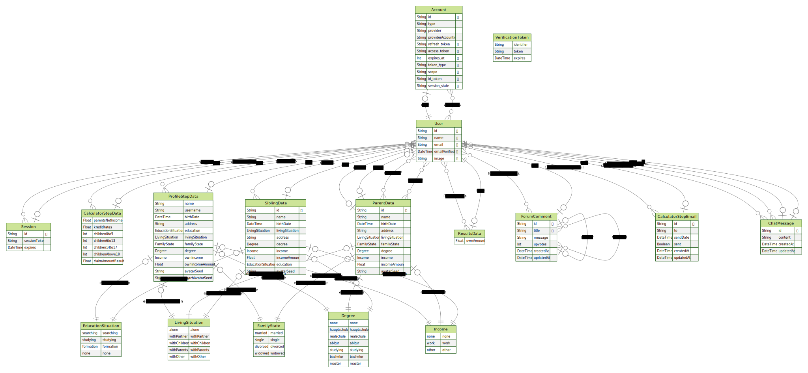

# ChildRight

For better handling of child support. Digital, social, and courageous. The ChildRight application is designed to empower people to bring about the enforcement of a child support claim independently. The AI-supported app, with interactive knowledge transfer, community function, and suitable text templates, is designed to pick up users where they are and accompany them step by step. Basically a step-by-step wizard. At the beginning, the form estimates child support. Then you create profiles for yourself, your parents and siblings. The further steps provide customized templates for the respective requirements.

This is a [T3 Stack](https://create.t3.gg/) project bootstrapped with `create-t3-app`.

## How to install

- rename .env.example to .env and add your env variables
- setup a MySQL database and add the credentials to the .env file
- Create a GitHub OAuth app and add the client id and secret to the .env file
- cd into the project directory
- `npm install`

## How to run

- `npm run dev`, this will start the server and make it accessible through the web browser at the specified URL.
- (if you don't have all environment variables): `SKIP_ENV_VALIDATION=1 npm run dev`

## Tech stack

Frontend:

- [React](https://reactjs.org/)
- [Next.js](https://nextjs.org/)
- [TypeScript](https://www.typescriptlang.org/)
- [Tailwind CSS](https://tailwindcss.com/)
- [TRPC](https://trpc.io/)
- [React Query](https://react-query.tanstack.com/)
- [Mantine](https://mantine.dev/)
- [Formik](https://formik.org/)
- [Storybook](https://storybook.js.org/)

Backend:

- [Next.js](https://nextjs.org/)
- [TypeScript](https://www.typescriptlang.org/)
- [Node.js](https://nodejs.org/en/)
- [TRPC](https://trpc.io/)
- [Zod](https://github.com/colinhacks/zod)

Database:

- [Prisma](https://www.prisma.io/)
- [MySQL](https://www.mysql.com/)
- [Planetscale](https://planetscale.com/)

Authentication:

- [NextAuth.js](https://next-auth.js.org/)

Testing:

- [Playwright](https://playwright.dev/)
- [Vitest](https://vitest.dev/)

File Storage:

- [AWS S3](https://aws.amazon.com/s3/)

Realtime Communication:

- [Pusher](https://pusher.com/)

Logging:

- [Pino](https://getpino.io/)
- [Logflare](https://logflare.app/)

Hosting:

- [Vercel](https://vercel.com/)

Rate Limiting:

- [Upstash](https://upstash.com/)

CI/CD:

- [GitHub Actions](https://github.com/features/actions)

Email:

- [Namecheap](https://www.namecheap.com/)

Linting:

- [ESLint](https://eslint.org/)

## Documentation

### General

This app is basically a form consisting of multiple steps.
The forms state management is handled using the Formik library.
The different steps are persisted in the database and the user can continue where they left off.

The API is defined using the TRPC library.
This has the advantage that the frontend knows about the types of the API endpoints, which makes it easier to work with the API and less likely for runtime errors to occur.

The app is written in a monorepo structure. The frontend and backend are in the same repository.
Nextjs is being used to serve the frontend and the backend.
The hosting is done by Vercel, which is connected to the GitHub repository.

When a request is made to the backend, it goes through the TRPC middleware until it reaches the corresponding procedure.
The procedure has an input validation schema, which is used to validate the input. It will return an error if the input is invalid.

React Query on the frontend takes care to also display errors and loading states in the app.

### Auth

The authentication is done via NextAuth. For now, we have only implemented GitHub and Discord authentication. In the future, we want to add Google and Apple.

The OAuth flow works like this:

1. The user clicks on the login button
2. They can choose between GitHub and Discord.
3. The corresponding OAuth provider is notified by the backend with all the necessary information.
4. The OAuth provider creates a sign in link.
5. The backend redirects the user to the sign in link.
6. The user logs in to their account.
7. The OAuth provider validates the credentials and sends a request to the callback URL on the backend specified in the OAuth app settings. In the query params, it has a code to associate with the authentication process.
8. The backend sends the code to the OAuth provider to get the access token.
9. The OAuth provider sends the access token to the backend.
10. The backend stores the access token in the database and associates it to the user.
11. The backend creates a session with a session token and sends it to the frontend where it gets set as cookie.
12. All requests to the backend are now authenticated. The backend can get the user ID from the session token by querying the database.

Session tokens are more secure that JWTs, but also more performance heavy, as they need to be queryed from the database on every request.

The database is hosted on Planetscale. It is a managed database service, which is based on MySQL. It has a free tier, which is enough for our needs.

### File Storage

We offer a file upload service that lets the user upload one file. The file is stored in an AWS S3 bucket. Upon request, our backend gets a presigned URL from AWS S3, which is valid for 5 minutes. The frontend then uploads the file to the presigned URL. The file is then stored in the bucket. It is stored with the user ID as the key. This way, we can easily find the file again when the user wants to download it.

The files in the `childright-documents` bucket are not publicly accessible. When a user wants to do download the file, the backend gets it using the User ID and serves it.

### Realtime Communication

Because Serverless functions don't allow for long-running Websocket connections, we use Pusher to handle realtime communication. The users can send direct messages to each other by specifying a user ID.

When a user sends a message, the backend sends a request to Pusher to send the message to the other user. The other user receives a notification and can then fetch the message from the backend.

To test the chat, you have to create 2 user accounts in 2 different browsers. Then you can go to "/chat/:userID" to start a conversation

### Rate Limiting

We use Upstash to handle rate limiting. Upstash is a Redis-as-a-Service provider. We use it to store the number of requests a user has made in a period of time. If the user exceeds the limit, we redirect them to a "/api/blocked" endpoint, which returns a 429 status code.

### Email

We use Namecheap to send emails. We have a custom domain and a custom email address. We use the SMTP server to send emails. We use the nodemailer library to send emails.
Also we have a github action that sends an email to the developers when the main branch is updated.

### Logging

We use an Observer / Listener pattern to log events. We have a LoggerPublisher that can hold an array of Loggers. When an event is logged, it is sent to all Loggers. Also we can use an array of transformer functions to modify incoming messages how we like. We have a LogflareLogger that sends the logs to Logflare. Logflare is a logging service that is easy to use and has a free tier. We also have a ConsoleLogger that logs the events to the console. This is useful for development. The FileLogger can be useful if we log very long payloads in debugging.

### Testing

We use Playwright for e2e tests and Vitest for unit tests. Playwright is a browser automation library that can be used to run tests in different browsers. To run the tests with Playwright, use the "npx playwright test" command. To test a specific file, use the "npx playwright test filename" command. Vitest is a software testing tool optimized for TypeScript. To use vitest, run "npm run vitest".

### Linting

We use ESLint for linting with some additional config for TypeScript. Linting helps us identify and fix common coding errors and style inconsistencies, such as unused variables, undefined variables, or code that does not meet the project's coding standards. By using a linter, we can improve the overall quality of the code, make it more maintainable, and reduce the likelihood of bugs and errors. To get started with ESLint and TypeScript, make sure to have them installed in your development environment.

### Continuous Delivery

We use GitHub Actions to run unit tests when the main branch is changed or e2e tests when the the Vercel deployment finishes. We also have a GitHub Action that sends an email to the developers when the main branch is updated.

# Prisma / Database

The Prisma database setup involves defining a prisma schema called "schema.prisma". This schema is then used to generate a Prisma client. The Prisma client is used to interact with the database. It is used in the backend to define the API endpoints. It is also used in the frontend to fetch data from the database.

## Contributers

Ignazio Balistreri <ignazio.balistreri@code.berlin>
Mark Witt <mark.witt@code.berlin>

## License & copyright

© Ignazio Balistreri, CODE University of Applied Sciences Software Engineering
© Mark Witt, CODE University of Applied Sciences Software Engineering
